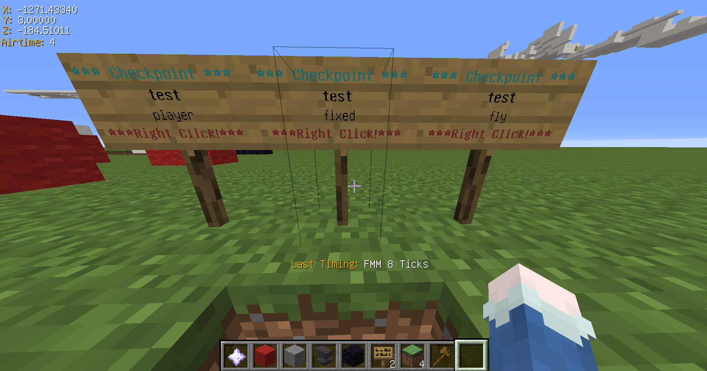

# 【Minecraft】Speedrun用プラグイン(タイム計測、チェックポイント)

---

## **対応バージョン**

- **Minecraft 1.12台** で動作確認済み  
  ※ 他のバージョンでの動作は未確認です。

---

## **機能**

- 設定したスタート地点から中継地点、ゴール地点間の移動にかかった現実時間及びゲーム内時間を表示
- 設定したチェックポイントへのテレポート

---

## ダウンロード

  <a href="https://github.com/cresc28/Speedrun/releases/tag/v2.2.0" style="font-size: 1.5em;">
    <strong>⬇️ SpeedrunPluginをダウンロード</strong>
  </a>

---

## **使い方**

<strong>コース設定</strong>

### `/course add <start|end|via_point> <コース名>`
スタート地点、中継地点、ゴール地点を設定します。(地点はブロックごとに設定可能です。) 
地点設定を行うブロックの上に立ち、地点タイプとコース名を指定してください。   
同一のコースには同一の名前を設定する必要があります。

同一の名前のスタート地点やゴール地点が複数存在する場合は、
最後に踏んだスタート地点から最初に踏んだゴール地点までの時間が計測・表示されます。

---

### `/course add via_point <コース名>　<中継地点名>`
名前付きで中継地点を登録します。 
内部的には`コース名.中継地点名`という形式で保存されます。
中継地点名は省略可能です。 

---

### `/course remove <start|end|via_point> <コース名>　または  /course remove <コース名>`
指定したコースのスタート地点、中継地点、ゴール地点を削除します。 
後者のコマンドでは、指定したコースの地点を一括で削除します。

---

### `/course list <start|end|via_point> または /course list` 
登録されているコースの一覧を表示します。

---

### `/course tp <start|end|via_point> <コース名> または /course tp <コース名>`
指定したコースへTPします。タイプを指定しない場合はスタート地点にTPされます。 
このコマンドは`/cp tp`に比べて低速です。

---

### その他
コースの計測開始メッセージやクリアメッセージを変更するには、  
`Speedrun`ディレクトリに生成される`message.yml`を編集してください。

<strong>チェックポイント設定</strong>

### 使い方
ネザースターを右クリックで最後に設定したチェックポイント(以下CP)にテレポートします。 
ネザースターを左クリックでGUIメニューを開きます。

---

### `/cp <CP名> または /cp`
現在位置にCPを登録します。 
名前を指定しなかった場合はtmpという名前でCPが登録されます。 
ネザースターを右クリックすると、その位置にテレポートします。

---

### `/cp remove <CP名>`
指定した名前のCPを削除します。

---

### `/cp tp <CP名>`
指定した名前のCPへTPします。

---

### `/cp list <ワールド名> または /cp list`
指定のワールドに存在するCPの一覧を表示します。 
ワールドの指定がない場合は現在のワールドに存在するCPの一覧を表示します。

---

### `/cp allowCrossWorldTp <true|false>`
ワールドを跨ぐCPでの移動を許可または禁止します。

---

### `/cp deleteCpOnStart <true|false>`
計測開始時にそのコースのCPを削除するか否かを設定します。 
trueに設定した場合、計測を開始したコースと同一の名前を持つCP(現在のワールドに限る)を削除します。

---

### 看板CP
某鯖のCPと同じです。 
看板の **1行目** に `cp`、**2行目** に `CP名`、**3行目** に `player`, `fixed`, `fly` のいずれかを記述してください。 

- `player` … 地上でのみCPをセットでき、プレイヤーのいる地点にCPがセットされます。
- `fixed` … 看板の位置にCPがセットされます。
- `fly` … 空中でCPのセットができ、プレイヤーのいる地点にCPがセットされます。

尚、2行目、3行目に記述がない場合は、CP名はtmp、typeはplayerと自動的に割り当てられます。

