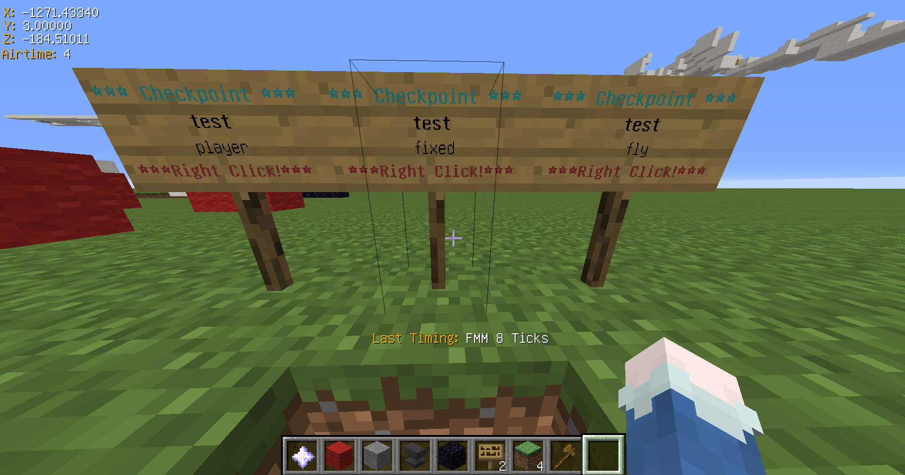
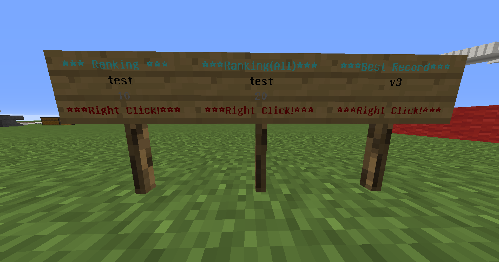

# 【Minecraft】Speedrun用プラグイン(タイム計測、チェックポイント、ランキング)

---

## **対応バージョン**

- **Minecraft 1.12台** で動作確認済み  
  ※ 他のバージョンでの動作は未確認です。

---

## **機能**

- 設定した地点間移動にかかった時間の計測
- 設定したチェックポイントへのテレポート
- 記録の保存&閲覧機能（ランキング）

---

## ダウンロード

  <a href="https://github.com/cresc28/Speedrun/releases/tag/v3.1.1" style="font-size: 1.5em;">
    <strong>⬇️ SpeedrunPluginをダウンロード</strong>
  </a>

---

## **使い方**
以下の説明において、`<>`は必須の引数、`[]`は任意の引数を表しています。

<strong>コース設定</strong>

### `/course add <start|end|via_point> <コース名>`
スタート地点、中継地点、ゴール地点を設定します。(地点はブロックごとに設定可能です。) 
地点設定を行うブロックの上に立ち、地点タイプとコース名を指定してください。   
別ワールドであっても同じコース名の場合、同じコースとして見做されます。

同一の名前のスタート地点やゴール地点が複数存在する場合は、
最後に踏んだスタート地点から最初に踏んだゴール地点までの時間が計測・表示されます。

---

### `/course add via_point <コース名>　[中継地点名]`
名前付きで中継地点を登録します。 
内部的には`コース名.中継地点名`という形式で保存されます。
中継地点名は省略可能です。
また、中継地点通過時にメッセージをブロードキャストするかについては、config.ymlのbroadcastViapointPassMessageの項目を設定してください。

---

### `/course remove [start|end|via_point] <コース名>`
指定コースのスタート地点、中継地点、ゴール地点を削除します。 
地点タイプを指定しない場合はそのコースのすべての地点を削除します。

---

### `/course list [start|end|via_point]` 
登録されているコースの一覧を表示します。

---

### `/course tp [start|end|via_point] <コース名>`
指定コースへTPします。タイプを指定しない場合はスタート地点にTPされます。 
このコマンドは`/cp tp`に比べて低速です。

---

### その他
コースの計測開始メッセージやクリアメッセージを変更するには、  
`Speedrun`ディレクトリに生成される`message.yml`を編集してください。

<strong>チェックポイント設定</strong>

### 使い方
ネザースターを右クリックで最後に設定したチェックポイント(以下CP)にテレポートします。 
ネザースターを左クリックでGUIメニューを開きます。

---

### `/cp [CP名]`
現在位置にCPを登録します。 
名前を指定しなかった場合はtmpという名前でCPが登録されます。 
ネザースターを右クリックすると、その位置にテレポートします。

---

### `/cp remove <CP名>`
指定したCPを削除します。

---

### `/cp tp <CP名>`
指定したCPへTPします。

---

### `/cp list [ワールド名]`
指定のワールドに存在するCPの一覧を表示します。 
ワールドの指定がない場合は現在のワールドに存在するCPの一覧を表示します。

---

### `/cp allowCrossWorldTp <true|false>`
ワールドを跨ぐCPでの移動を許可または禁止します。

---

### `/cp deleteCpOnStart <true|false>`
計測開始時にそのコースのCPを削除するか否かを設定します。 
trueに設定した場合、計測を開始したコースと同一の名前を持つCP(現在のワールドに限る)を削除します。

---

### 看板CP
某鯖のCPと同じです。 
看板の **1行目** に`cp`(必須)、**2行目** に`CP名`(任意)、**3行目** に`player`、`fixed`、`fly`(任意)のいずれかを記述してください。

- `player` … 地上でのみCPをセットでき、プレイヤーのいる地点にCPがセットされます。
- `fixed` … 看板の位置にCPがセットされます。
- `fly` … 空中でCPのセットができ、プレイヤーのいる地点にCPがセットされます。

尚、2行目、3行目に記述がない場合は、CP名はtmp、typeはplayerと自動的に割り当てられます。

<strong>ランキング機能</strong>

### `/top <コース名>`
指定コースのランキングを10位まで表示します。 
また、以下のオプションを順不同で使用可能です。

**オプション**
- `[表示件数]` ・・・ 半角数字でランキングの表示件数を指定できます。デフォルトは10、最大で30件まで表示可能です。
- `dup` ・・・ 同一プレイヤーの複数記録を含めたランキングを表示します。例えば、1位と2位に同じプレイヤーの記録が存在する場合でも両方表示されます。
- `above` ・・・ 自分の記録より上位の記録をn件表示します。プレイヤー名を共に指定することで、特定プレイヤーのより上位の記録の表示も可能です。
- `detail` ・・・ 中継地点が存在するコースの場合、中継地点通過タイムとラップタイムを表示します。他プレイヤーの詳細情報を表示したい場合は、プレイヤー名を共に指定してください。

**使用例**
- `/top コースA dup 20` ・・・ コースAの記録を同一プレイヤーの複数記録を含めてランキング形式で20件表示します。
- `/top コースA above BBBB`・・・コースAのBBBBさんのベスト記録より上位の記録を表示します。BBBBさんが31位の場合、21-31位までの記録が表示されます。
- `/top コースA detail BBBB` ・・・ BBBBさんの記録の詳細を表示します。

---

### `/record add <コース名> <プレイヤー名> <タイム(Tick数)>`
記録を追加します。タイムは半角数字でtick数で入力してください。

---

### `/record remove <コース名> <プレイヤー名>`
削除したい記録の保持者とコース名を指定してください。 
コマンド入力後、削除メニューが開くので、そこで削除したいタイムを選択してください。
topコマンドでプレイヤー名がUUID表示されている場合は、UUIDからプレイヤー名を検索する必要があります。

---

### `/record removeAll <コース名> <プレイヤー名>`
指定コースの指定プレイヤーの記録をすべて削除します。

---

### `/cp record removePlayerAll <プレイヤー名>`
指定プレイヤーの記録を全コースから削除します。 
このコマンドはサーバーコンソールからのみ実行可能です。

---

### `/cp record removeCourseAll <コース名>`
指定コースの記録を全て削除します。 
このコマンドはサーバーコンソールからのみ実行可能です。

### ランキング看板
クリックすることでランキングを表示する看板を作成できます。 
看板の**1行目** に`top`(必須)、**2行目** に`コース名`(必須)を記述してください。
また、**3行目** には`表示件数`(任意)、4行目には`dup`、`detail`(任意)のオプションが記述可能です。 

### その他
各コースの各プレイヤーの記録はデフォルトで最大10件まで保存され、それを超えた場合は悪い記録から順に削除されます。 
保存上限を変更したい場合は、`config`ディレクトリ内の`maxRecordStored`を編集してください。

